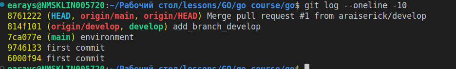
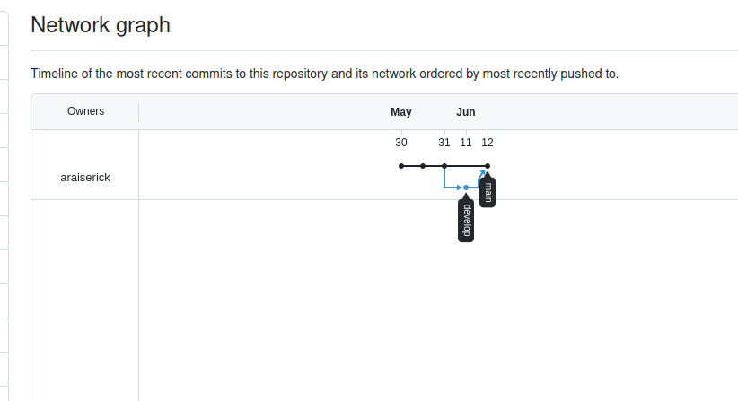

# Тема: Осваиваем работу с git репозиторием


### Создание базовой ветки проекта любая например: main, develop, dev и создание новой ветки от базовой;

```bash
git checkout -b develop
```

### Добавление кода, выполнение комита в новой ветке;

После добавления кода
```bash
git add .
git commit -m "add_branch_develop"
```
### Запушить в удаленный репозиторий новую ветку;
    
```bash
git push origin develop
```
### Создать pull request и смержить изменения в базовую ветку на github. Обновляем локальную базовую ветку fetch, pull; Проверить что все изменения комита в основной ветке.

```bash
git checkout origin/main
git pull origin main
```


